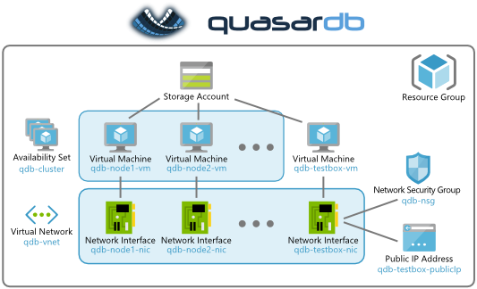

# quasardb cluster deployment template

This repository contains the source code of the ARM template that is available on the Azure Marketplace under the name "quasardb cluster".

This template deploys a quasardb cluster on Azure.

## Topology

It provision the following resources:

* a storage account (optional: can reuse an existing one)
* a virtual network
* an availability set
* several nodes, each composed of:
 * a virtual machine running quasardb server on Ubuntu
 * a network interface
* a testbox, composed of:
 * a virtual machine with quasardb client tools on Ubuntu
 * a network interface
 * a public IP address
 * a network security group

## The testbox

The cluster nodes are internal and only accessible on the virtual network.
The cluster can be accessed through a "testbox" accessible via SSH (port 22) on a public IP.
It contains the followings:

1. `qdb_httpd`, a web monitoring console, listening on public port 8080
2. `qdbsh`, the quasardb shell utility
3. `qdb-benchmark`, the quasardb performance testing tool
4. quasardb APIs for: C, PHP, and Python

## Warning about storage

There is no network storage attached to the nodes!
For performance reasons, the cluster's data is stored **on the machine local drive**.
The consequence is that the data is be lost if you deprovision the all the VMs.
However, since data is replicated between the nodes (3 times by default), the data is not lost if only a few nodes are removed.

## Debugging Tools

* [Deploy in development mode](https://portal.azure.com/#create/Microsoft.Template/uri/https:%2F%2Fraw.githubusercontent.com%2Fbureau14%2Fqdb-azure-template%2Fmaster%2FmainTemplate.json) (caution: license fees apply)
* [Open the GUI in development mode](https://portal.azure.com/?clientOptimizations=false#blade/Microsoft_Azure_Compute/CreateMultiVmWizardBlade/internal_bladeCallId/anything/internal_bladeCallerParams/{"initialData":{},"providerConfig":{"createUiDefinition":"https:%2F%2Fraw.githubusercontent.com%2Fbureau14%2Fqdb-azure-template%2Fmaster%2FcreateUiDefinition.json"}}) (this wont deploy anything)